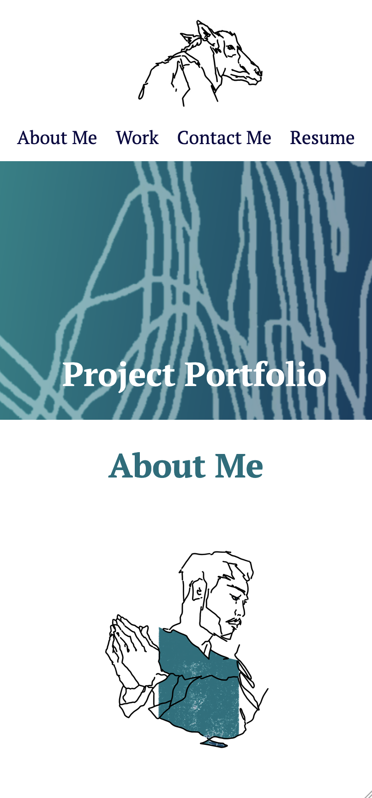

# Description

Portofolio template to show future employers on previous projects.

This website was built following these criteria:
1) When the page is loaded the page presents your name, a recent photo or avatar, and links to sections about you, your work, and how to contact you
2) When one of the links in the navigation is clicked then the UI scrolls to the corresponding section
3) When viewing the section about your work then the section contains titled images of your applications
4) When presented with the your first application then that application's image should be larger in size than the others
5) When images of the applications are clicked then the user is taken to that deployed application
6) When the page is resized or viewed on various screens and devices then the layout is responsive and adapts to my viewport

# Installation

For any future use: files can be managed and edited through any IDE (VSCode recommended) and changes can be checked on a browser locally.

# Usage

Deployed portfolio can be accessed through this [link](https://kuuyyaa.github.io/02-portfolio/).

As of latest update, only one project application (SEO) is deployed. More will be added in the near future.
'Resume' in the navigation bar is non-responsive, but will be linked to a completed resume in a following update.

This website has been optimized to work on mobile devices:

* All artwork used is made by me (@ku_yya on instagram). 
Please do not use without permission. 